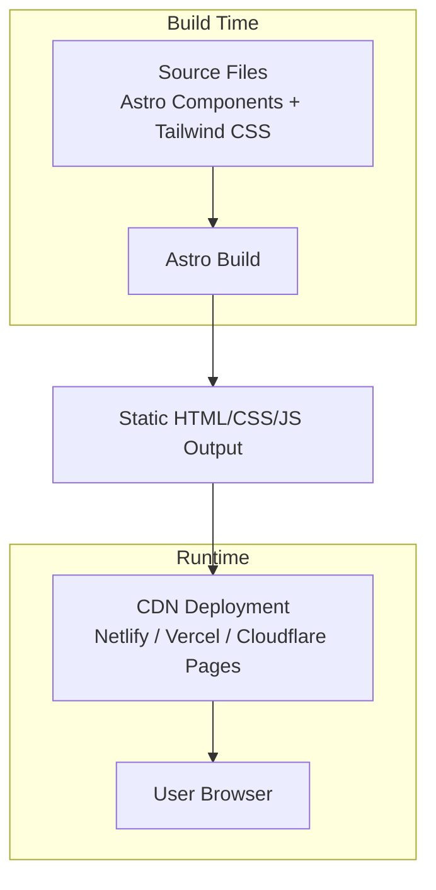
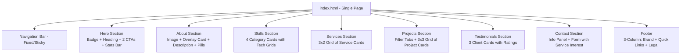

# Design Document: GeekBytes Portfolio Website

## Overview

The GeekBytes portfolio website is a single-page, static marketing site built to showcase the company's six IT services, nine portfolio projects, client testimonials, and contact information. The architecture prioritizes extreme loading speed by using a zero-JavaScript-by-default static site generator (Astro) paired with utility-first CSS (Tailwind CSS). The site renders entirely at build time, producing pure HTML and CSS with minimal JavaScript only where interactivity is strictly required (mobile menu toggle, smooth scrolling, form validation, project filtering, scroll animations).

### Key Design Decisions

1. **Astro as the static site generator** — Ships zero client-side JavaScript by default. Components render to static HTML at build time. Only interactive "islands" receive JavaScript, keeping the payload minimal. This directly addresses the performance requirement (Lighthouse ≥ 90).

2. **Tailwind CSS for styling** — Utility-first approach produces highly optimized CSS bundles via PurgeCSS (built into Tailwind). No unused CSS ships to production. Dark theme tokens (#000000 background, #00A3FF accent, #FFFFFF text) map cleanly to Tailwind's configuration.

3. **No frontend framework (React, Vue, etc.)** — The site has no complex state management needs. Astro components with vanilla JS for the interactive elements (hamburger menu, project filter tabs, form validation, scroll animations) keeps the bundle near zero.

4. **Static HTML output deployed to CDN** — The build output is plain HTML/CSS/JS files deployable to any CDN (Netlify, Vercel, Cloudflare Pages) for sub-100ms TTFB globally.

5. **Client-side project filtering** — Filter tabs use vanilla JS to toggle visibility of project cards by category. No page reload or server-side logic needed since all 9 projects are rendered in the HTML at build time.

## Architecture

### High-Level Architecture



### Page Structure



### Performance Architecture

The performance strategy operates at three levels:

1. **Build-time optimization**: Astro compiles everything to static HTML. Tailwind purges unused CSS. Images are processed and optimized during build.
2. **Network-level optimization**: CDN delivery, preconnect hints, asset fingerprinting for long-term caching, gzip/brotli compression.
3. **Runtime optimization**: Lazy loading for below-fold images, minimal JS (< 5KB total), CSS loaded inline for critical path, deferred non-critical resources.

## Components and Interfaces

### Component Tree

```
src/
├── layouts/
│   └── BaseLayout.astro          # HTML shell, meta tags, global styles
├── components/
│   ├── Navbar.astro              # Fixed nav + active highlighting + mobile hamburger
│   ├── HeroSection.astro         # Badge, heading, subtext, 2 CTAs, stats bar
│   ├── AboutSection.astro        # Two-column: image w/ overlay card + text + pills
│   ├── SkillsSection.astro       # 4 category cards with tech icon grids
│   ├── ServicesSection.astro     # 3x2 grid of service cards with bullet points
│   ├── ProjectsSection.astro    # Filter tabs + 3x3 project grid
│   ├── ProjectCard.astro         # Individual project card with tags, stats
│   ├── TestimonialsSection.astro # 3 testimonial cards with avatars + ratings
│   ├── ContactSection.astro      # Split: contact info + form w/ service interest
│   ├── Footer.astro              # 3-column: brand, quick links, legal
│   └── icons/                    # SVG icon components
│       ├── Logo.astro            # GeekBytes logo
│       ├── LinkedIn.astro
│       ├── Twitter.astro
│       ├── Instagram.astro
│       └── ...technology icons
├── scripts/
│   ├── mobile-menu.js            # Hamburger toggle (~0.5KB)
│   ├── smooth-scroll.js          # Scroll behavior (~0.3KB)
│   ├── active-nav.js             # IntersectionObserver for active section highlighting (~0.5KB)
│   ├── project-filter.js         # Filter tabs click handler (~0.5KB)
│   ├── form-validation.js        # Client-side validation (~1KB)
│   └── scroll-animations.js     # IntersectionObserver for fade-in (~0.5KB)
├── data/
│   ├── site.ts                   # Global site config
│   ├── navigation.ts             # Nav items
│   ├── services.ts               # 6 services with bullet points
│   ├── projects.ts               # 9 projects with tags, stats, categories
│   ├── skills.ts                 # 4 category cards with tech items
│   └── testimonials.ts           # 3 client testimonials
├── styles/
│   └── global.css                # Tailwind directives + custom properties
├── pages/
│   └── index.astro               # Single page composing all sections
└── public/
    ├── images/
    │   ├── projects/             # Optimized project thumbnails (9 images)
    │   ├── testimonials/         # Client avatar images (3 images)
    │   ├── about/                # Team/office image
    │   └── hero/                 # Hero background (if needed)
    ├── sitemap.xml               # Generated at build
    ├── robots.txt
    └── favicon.svg
```

### Component Interfaces

#### BaseLayout.astro
```typescript
interface Props {
  title: string;        // Page title for <title> tag
  description: string;  // Meta description
  ogImage?: string;     // Open Graph image path
}
```
Responsibilities: HTML document shell, meta tags (SEO, Open Graph, Twitter Cards), font preloading, global CSS injection, ARIA landmarks.

#### Navbar.astro
```typescript
interface NavLink {
  label: string;    // Display text (e.g., "Home", "About", "Skills")
  href: string;     // Section anchor (e.g., "#about")
}

// Rendered nav links: Home, About, Skills, Services, Projects, Testimonials
// Separate "Contact Us" pill button on the right
```
Responsibilities:
- Fixed positioning at top of viewport
- Section links with active state (blue underline indicator via IntersectionObserver)
- Separate blue pill-shaped "Contact Us" button on the right
- GeekBytes logo on the left
- Hamburger menu on mobile (≤ 768px) with vertical overlay
- Smooth scroll on click

#### HeroSection.astro
```typescript
// No external props — content is static/hardcoded
// Internal structure:
interface HeroContent {
  badge: {
    dotColor: string;     // Green dot indicator
    text: string;         // "Innovative IT Solutions"
  };
  heading: string;        // "Empowering Your Digital Future"
  subtext: string;        // Descriptive paragraph
  primaryCTA: {
    label: string;        // "Get in Touch"
    href: string;         // "#contact"
    style: "filled";      // Blue filled button
  };
  secondaryCTA: {
    label: string;        // "View Our Work →"
    href: string;         // "#projects"
    style: "outline";     // Ghost/outline button
  };
  stats: StatItem[];      // 4 metrics
}

interface StatItem {
  value: string;          // e.g., "50+"
  label: string;          // e.g., "Projects Delivered"
}
```
Responsibilities: Full-viewport hero with dark background, badge, heading, subtext, two CTA buttons, and a stats bar showing 4 metrics with #00A3FF numbers and gray labels.

#### AboutSection.astro
```typescript
// No external props — content is static
// Internal structure:
interface AboutContent {
  sectionLabel: string;     // "ABOUT GEEKBYTES" (blue uppercase)
  heading: string;          // "Bridging the gap between vision and technology."
  highlightedWords: string[]; // ["vision", "technology"] — styled in #00A3FF
  paragraphs: string[];     // Descriptive content
  image: string;            // Team/office image path
  overlayCard: {
    text: string;           // "50+ Projects Delivered"
  };
  featurePills: FeaturePill[];
}

interface FeaturePill {
  icon: string;             // "rocket" | "shield"
  label: string;            // "Innovation First" | "Secure by Design"
}
```
Responsibilities: Two-column layout with team image (left, with overlay card) and text content (right). Feature pills displayed at the bottom.

#### SkillsSection.astro
```typescript
interface SkillCategory {
  name: string;             // e.g., "Frontend"
  icon: string;             // Category icon identifier
  iconColor: string;        // Colored icon header
  skills: SkillItem[];
}

interface SkillItem {
  name: string;             // e.g., "React"
  icon: string;             // Technology icon path/identifier
}

// 4 categories:
// Frontend: React, Vue, Angular, HTML5, CSS3, JavaScript
// Backend: Node.js, Python, Java, PHP, Go
// Data & Cloud: AWS, GCP, Docker, MongoDB, SQL
// Tools & Design: Git, GitHub, Figma, Jira, Slack
```
Responsibilities: Section label ("OUR EXPERTISE"), heading ("Technologies We Master"), subtext, and 4 category cards in a row. Each card has a colored icon header and a grid of technology icons with labels. Fade/slide animation on viewport entry.

#### ServicesSection.astro
```typescript
interface ServiceCard {
  icon: string;             // Blue icon identifier
  title: string;            // Service name
  description: string;      // Service description paragraph
  bulletPoints: string[];   // 3 blue-checkmark bullet items
}

// 6 services in 3x2 grid:
// 1. WordPress Development: Custom Theme & Plugin Dev, WooCommerce Stores, LMS & Membership Sites
// 2. AI Chatbots & Automation: GPT-4 Powered Chatbots, WhatsApp Business API, Workflow Automation
// 3. GoHighLevel CRM: Pipeline & Funnel Setup, SMS/Email Sequences, White-Label Agency Setup
// 4. Mobile App Development: iOS (Swift) & Android (Kotlin), React Native / Flutter, App Store Optimization
// 5. Custom Software Solutions: SaaS Product Development, ERP / Internal Dashboards, API Design & Integration
// 6. Cloud Architecture: AWS / Azure / GCP, Microservices & Serverless, CI/CD & DevOps Pipelines
```
Responsibilities: Section label ("WHAT WE DO"), heading ("Comprehensive IT Services"), subtext, and 3x2 grid of service cards. Each card has a blue icon, title, description, and blue checkmark bullet points. Hover effect on desktop.

#### ProjectsSection.astro
```typescript
interface FilterTab {
  label: string;            // Tab display text
  category: string;         // Filter category key
}

// Filter tabs: All, AI & Automation, WordPress, CRM & Platforms, Mobile Apps, Custom Software, Cloud
```
Responsibilities: Section label ("PORTFOLIO"), heading ("Featured Projects"), "View All Projects →" link, filter tabs, and 3-column grid of ProjectCard components. Handles filter tab click events to show/hide project cards by category. Single-column on mobile, 3-column on desktop.

#### ProjectCard.astro
```typescript
interface Props {
  name: string;             // e.g., "SmartServe AI Assistant"
  description: string;      // Short description in gray text
  thumbnail: string;        // Path to optimized thumbnail image
  techTags: string[];       // Blue outline pill tags (e.g., ["AI Chatbot", "GPT-4", "Node.js"])
  category: string;         // Filter category (e.g., "ai-automation")
  stats?: ProjectStat[];    // Optional stats row at bottom
}

interface ProjectStat {
  value: string;            // e.g., "55%", "12", "2wk"
  label: string;            // e.g., "Close Rate Up", "Automations", "Delivery"
}
```
Responsibilities: Renders individual project card with thumbnail (with "View Case Study" hover overlay), tech tags as blue outline pills, project name (white bold), description (gray), and optional stats row (blue numbers + gray labels).

#### TestimonialsSection.astro
```typescript
interface Testimonial {
  name: string;             // e.g., "David Chen"
  role: string;             // e.g., "CTO, NexPay"
  avatar: string;           // Path to avatar image
  rating: number;           // Star rating (5)
  quote: string;            // Testimonial quote text
}

// 3 testimonials:
// David Chen - CTO, NexPay
// Sarah Jenkins - Founder, MediConnect
// Marcus Thorne - Dir. E-commerce, Lumina
```
Responsibilities: Section label ("CLIENT SUCCESS"), heading ("Why Work With Us"), and 3 testimonial cards in a row. Each card displays avatar, name (white bold), role (gray), 5-star gold rating, and quote (gray italic).

#### ContactSection.astro
```typescript
interface ContactInfo {
  email: string;            // "geekbytessolutions@gmail.com"
  phone: string;            // "8217720086"
  location: string;         // "Remote Worldwide"
  socialLinks: {
    linkedin: string;
    twitter: string;
    instagram: string;
  };
}

interface ServiceInterestOption {
  value: string;            // Form value
  label: string;            // Display label
}

// Service interest options (radio/chip selector):
// WordPress Dev, WhatsApp Automation, AI Chatbots, GoHighLevel CRM,
// Mobile App (iOS/Android), Custom Software, Cloud Architecture

// Form fields:
// Full Name (required), Email Address (required), Phone Number (optional),
// Service Interest Selector, Project Details textarea
// Submit button: "Send Message ✈" (full-width blue)
```
Responsibilities: Section label ("CONTACT US"), heading ("Let's Build Something Great."), subtext, split layout with contact info panel (left: email, phone, location with icons + social icons) and form (right: name, email, phone, service interest chips, project details, submit button). Client-side validation with inline error messages.

#### Footer.astro
```typescript
interface FooterColumn {
  heading?: string;
  links?: FooterLink[];
  content?: string;
}

interface FooterLink {
  label: string;
  href: string;
}

// 3-column layout:
// Left: GeekBytes logo + tagline paragraph
// Center: "Quick Links" — Home, About Us, Services, Projects
// Right: "Legal" — Privacy Policy, Terms of Service, Cookie Policy
// Bottom bar: "© 2026 GeekBytes. All rights reserved." | "Designed with 💙 for the future."
```
Responsibilities: Dark background, 3-column grid layout with brand info, quick links (scroll to sections), and legal links. Bottom bar with copyright and tagline.

### Interaction Scripts

All scripts are vanilla JavaScript, loaded with `type="module"` and deferred. Total budget: < 5KB minified.

| Script | Purpose | Size Target |
|--------|---------|-------------|
| mobile-menu.js | Toggle hamburger menu visibility | < 500B |
| smooth-scroll.js | Smooth scroll to section anchors | < 300B |
| active-nav.js | IntersectionObserver to highlight active nav link with blue underline | < 500B |
| project-filter.js | Filter tab click → show/hide project cards by category | < 500B |
| form-validation.js | Validate required fields, show inline errors | < 1KB |
| scroll-animations.js | IntersectionObserver for fade/slide reveal animations | < 500B |

## Data Models

This is a static site with no database or API. All data is defined as static arrays in dedicated data files under `src/data/`.

### Site Configuration

```typescript
// src/data/site.ts
interface SiteConfig {
  name: string;                 // "GeekBytes"
  tagline: string;              // "Empowering businesses with modern, scalable, and secure technology solutions. Your trusted IT partner."
  email: string;                // "geekbytessolutions@gmail.com"
  phone: string;                // "8217720086"
  location: string;             // "Remote Worldwide"
  social: {
    linkedin: string;
    twitter: string;
    instagram: string;
  };
  meta: {
    title: string;              // SEO title
    description: string;        // SEO description
    ogImage: string;            // Open Graph image path
  };
}
```

### Navigation Data

```typescript
// src/data/navigation.ts
interface NavItem {
  label: string;          // Display text
  href: string;           // Anchor link
}

const navItems: NavItem[] = [
  { label: "Home", href: "#hero" },
  { label: "About", href: "#about" },
  { label: "Skills", href: "#skills" },
  { label: "Services", href: "#services" },
  { label: "Projects", href: "#projects" },
  { label: "Testimonials", href: "#testimonials" },
];

// "Contact Us" is a separate pill button, not in the nav items array
const contactButton = { label: "Contact Us", href: "#contact" };
```

### Service Data

```typescript
// src/data/services.ts
interface Service {
  icon: string;             // Icon identifier (e.g., "wordpress", "ai-bot", "crm")
  title: string;            // Service name
  description: string;      // Short description paragraph
  bulletPoints: string[];   // 3 key offerings with blue checkmarks
}

const services: Service[] = [
  {
    icon: "wordpress",
    title: "WordPress Development",
    description: "...",
    bulletPoints: ["Custom Theme & Plugin Dev", "WooCommerce Stores", "LMS & Membership Sites"]
  },
  {
    icon: "ai-bot",
    title: "AI Chatbots & Automation",
    description: "...",
    bulletPoints: ["GPT-4 Powered Chatbots", "WhatsApp Business API", "Workflow Automation"]
  },
  {
    icon: "crm",
    title: "GoHighLevel CRM",
    description: "...",
    bulletPoints: ["Pipeline & Funnel Setup", "SMS/Email Sequences", "White-Label Agency Setup"]
  },
  {
    icon: "mobile",
    title: "Mobile App Development",
    description: "...",
    bulletPoints: ["iOS (Swift) & Android (Kotlin)", "React Native / Flutter", "App Store Optimization"]
  },
  {
    icon: "software",
    title: "Custom Software Solutions",
    description: "...",
    bulletPoints: ["SaaS Product Development", "ERP / Internal Dashboards", "API Design & Integration"]
  },
  {
    icon: "cloud",
    title: "Cloud Architecture",
    description: "...",
    bulletPoints: ["AWS / Azure / GCP", "Microservices & Serverless", "CI/CD & DevOps Pipelines"]
  },
];
```

### Project Data

```typescript
// src/data/projects.ts
interface ProjectStat {
  value: string;            // e.g., "55%", "12", "2wk"
  label: string;            // e.g., "Close Rate Up", "Automations", "Delivery"
}

interface Project {
  name: string;             // e.g., "SmartServe AI Assistant"
  slug: string;             // e.g., "smartserve-ai"
  description: string;      // Short project description
  thumbnail: string;        // Image path
  techTags: string[];       // Blue outline pill tags
  category: string;         // Filter category key
  stats?: ProjectStat[];    // Optional stats row (up to 3 stats)
}

const filterCategories = [
  { label: "All", key: "all" },
  { label: "AI & Automation", key: "ai-automation" },
  { label: "WordPress", key: "wordpress" },
  { label: "CRM & Platforms", key: "crm-platforms" },
  { label: "Mobile Apps", key: "mobile-apps" },
  { label: "Custom Software", key: "custom-software" },
  { label: "Cloud", key: "cloud" },
] as const;

const projects: Project[] = [
  {
    name: "SmartServe AI Assistant",
    slug: "smartserve-ai",
    description: "...",
    thumbnail: "/images/projects/smartserve.webp",
    techTags: ["AI Chatbot", "GPT-4", "Node.js"],
    category: "ai-automation",
  },
  {
    name: "Prestige Realty Portal",
    slug: "prestige-realty",
    description: "...",
    thumbnail: "/images/projects/prestige-realty.webp",
    techTags: ["WordPress", "WooCommerce", "Elementor"],
    category: "wordpress",
  },
  {
    name: "RetailFlow Messenger Bot",
    slug: "retailflow-bot",
    description: "...",
    thumbnail: "/images/projects/retailflow.webp",
    techTags: ["WhatsApp Automation", "Twilio"],
    category: "ai-automation",
  },
  {
    name: "AgencyPro CRM Setup",
    slug: "agencypro-crm",
    description: "...",
    thumbnail: "/images/projects/agencypro.webp",
    techTags: ["GoHighLevel CRM", "Automation"],
    category: "crm-platforms",
    stats: [
      { value: "55%", label: "Close Rate Up" },
      { value: "12", label: "Automations" },
      { value: "2wk", label: "Delivery" },
    ],
  },
  {
    name: "EduVault Learning Platform",
    slug: "eduvault",
    description: "...",
    thumbnail: "/images/projects/eduvault.webp",
    techTags: ["WordPress", "LearnDash", "LMS"],
    category: "wordpress",
    stats: [
      { value: "8K+", label: "Students" },
      { value: "120+", label: "Courses" },
      { value: "4.9★", label: "Avg Rating" },
    ],
  },
  {
    name: "ContentForge AI",
    slug: "contentforge",
    description: "...",
    thumbnail: "/images/projects/contentforge.webp",
    techTags: ["AI Platform", "UX Pilot AI", "React"],
    category: "ai-automation",
    stats: [
      { value: "10x", label: "Output Speed" },
      { value: "500+", label: "Active Users" },
      { value: "30+", label: "Templates" },
    ],
  },
  {
    name: "FitPulse Health App",
    slug: "fitpulse",
    description: "...",
    thumbnail: "/images/projects/fitpulse.webp",
    techTags: ["Mobile App", "React Native", "iOS & Android"],
    category: "mobile-apps",
    stats: [
      { value: "25K+", label: "Downloads" },
      { value: "4.8★", label: "App Rating" },
      { value: "2", label: "Platforms" },
    ],
  },
  {
    name: "LogiTrack ERP Suite",
    slug: "logitrack",
    description: "...",
    thumbnail: "/images/projects/logitrack.webp",
    techTags: ["Custom Software", "Node.js", "React"],
    category: "custom-software",
    stats: [
      { value: "70%", label: "Ops Efficiency" },
      { value: "15", label: "Modules" },
      { value: "500+", label: "Daily Users" },
    ],
  },
  {
    name: "ScaleCloud FinTech Infra",
    slug: "scalecloud",
    description: "...",
    thumbnail: "/images/projects/scalecloud.webp",
    techTags: ["Cloud Architecture", "AWS", "Terraform"],
    category: "cloud",
    stats: [
      { value: "99.99%", label: "Uptime" },
      { value: "60%", label: "Cost Saved" },
      { value: "3", label: "Regions" },
    ],
  },
];
```

### Skills Data

```typescript
// src/data/skills.ts
interface SkillItem {
  name: string;             // Technology name
  icon: string;             // Icon path or identifier
}

interface SkillCategory {
  name: string;             // Category name
  icon: string;             // Category header icon
  iconColor: string;        // Header icon accent color
  skills: SkillItem[];
}

const skillCategories: SkillCategory[] = [
  {
    name: "Frontend",
    icon: "monitor",
    iconColor: "#00A3FF",
    skills: [
      { name: "React", icon: "react" },
      { name: "Vue", icon: "vue" },
      { name: "Angular", icon: "angular" },
      { name: "HTML5", icon: "html5" },
      { name: "CSS3", icon: "css3" },
      { name: "JavaScript", icon: "javascript" },
    ],
  },
  {
    name: "Backend",
    icon: "server",
    iconColor: "#00A3FF",
    skills: [
      { name: "Node.js", icon: "nodejs" },
      { name: "Python", icon: "python" },
      { name: "Java", icon: "java" },
      { name: "PHP", icon: "php" },
      { name: "Go", icon: "go" },
    ],
  },
  {
    name: "Data & Cloud",
    icon: "cloud",
    iconColor: "#00A3FF",
    skills: [
      { name: "AWS", icon: "aws" },
      { name: "GCP", icon: "gcp" },
      { name: "Docker", icon: "docker" },
      { name: "MongoDB", icon: "mongodb" },
      { name: "SQL", icon: "sql" },
    ],
  },
  {
    name: "Tools & Design",
    icon: "tool",
    iconColor: "#00A3FF",
    skills: [
      { name: "Git", icon: "git" },
      { name: "GitHub", icon: "github" },
      { name: "Figma", icon: "figma" },
      { name: "Jira", icon: "jira" },
      { name: "Slack", icon: "slack" },
    ],
  },
];
```

### Testimonials Data

```typescript
// src/data/testimonials.ts
interface Testimonial {
  name: string;             // Client name
  role: string;             // Title and company
  avatar: string;           // Avatar image path
  rating: number;           // Star rating (1-5)
  quote: string;            // Testimonial text
}

const testimonials: Testimonial[] = [
  {
    name: "David Chen",
    role: "CTO, NexPay",
    avatar: "/images/testimonials/david-chen.webp",
    rating: 5,
    quote: "...",
  },
  {
    name: "Sarah Jenkins",
    role: "Founder, MediConnect",
    avatar: "/images/testimonials/sarah-jenkins.webp",
    rating: 5,
    quote: "...",
  },
  {
    name: "Marcus Thorne",
    role: "Dir. E-commerce, Lumina",
    avatar: "/images/testimonials/marcus-thorne.webp",
    rating: 5,
    quote: "...",
  },
];
```

### Contact Form Data

```typescript
// src/data/contact.ts
interface ServiceInterestOption {
  value: string;
  label: string;
}

const serviceInterestOptions: ServiceInterestOption[] = [
  { value: "wordpress", label: "WordPress Dev" },
  { value: "whatsapp", label: "WhatsApp Automation" },
  { value: "ai-chatbots", label: "AI Chatbots" },
  { value: "gohighlevel", label: "GoHighLevel CRM" },
  { value: "mobile-app", label: "Mobile App (iOS/Android)" },
  { value: "custom-software", label: "Custom Software" },
  { value: "cloud", label: "Cloud Architecture" },
];
```

## Error Handling

### Form Validation Errors

- **Missing required fields (Full Name, Email)**: Inline error messages displayed below each field with red text and ARIA `aria-invalid="true"` + `aria-describedby` linking to the error message.
- **Invalid email format**: Regex validation with descriptive error ("Please enter a valid email address").
- **Service interest not selected**: Visual indicator prompting selection (optional — depends on whether this is marked required).
- **Form submission failure**: If using a form service (Formspree/Netlify Forms), display a generic error message ("Something went wrong. Please try again or email us directly.") with fallback to the direct email link.
- **Success state**: Display a success confirmation message replacing the form or as an overlay.

### Image Loading Errors

- **Failed image loads**: Each `` has a CSS background-color fallback matching the dark theme, so broken images show a dark placeholder rather than a broken icon.
- **Project thumbnails**: Use `loading="lazy"` for all below-fold project/testimonial images.
- **Avatar images**: Small file size (< 10KB each), loaded eagerly in testimonials section if above fold.

### JavaScript Failure Graceful Degradation

- **Navigation**: Anchor links work natively without JS (browser jumps to `#id`). Smooth scrolling is an enhancement. Active highlighting is additive.
- **Mobile menu**: CSS-only fallback using `:target` pseudo-class or checkbox hack as progressive enhancement.
- **Project filtering**: All 9 projects are visible by default in HTML. Filter tabs are a JS enhancement — without JS, all projects display.
- **Form**: HTML5 `required` and `type="email"` provide native validation without JS. Service interest selector functions as standard radio inputs.
- **Animations**: Content is visible by default; scroll animations are additive via IntersectionObserver.

### Browser Compatibility

- Target: All modern browsers (Chrome 90+, Firefox 90+, Safari 14+, Edge 90+).
- Graceful degradation for older browsers — content remains accessible, only enhancements (animations, smooth scroll, filter tabs) are lost.

## Testing Strategy

### Why Property-Based Testing Does Not Apply

This feature is a static frontend portfolio website consisting of HTML/CSS rendering, layout, and minimal client-side interactions (menu toggle, project filtering, form validation, smooth scroll). There are no parsers, serializers, complex data transformations, or algorithmic business logic. The output is deterministic UI rendering, which falls into the "UI rendering and layout" category where PBT is not appropriate. Instead, we use build verification, accessibility scanning, performance scoring, and example-based functional tests.

### Testing Approach

#### 1. Build Verification Tests
- Verify Astro build completes without errors
- Verify all pages are generated (index.html, sitemap.xml)
- Verify no broken internal links
- Verify all 9 project images referenced exist in output

#### 2. Lighthouse CI / Performance Tests
- Automated Lighthouse runs on the built output
- Assert Performance score ≥ 90
- Assert LCP < 2.5s
- Assert no render-blocking resources
- Verify lazy loading is applied to below-fold images

#### 3. Accessibility Tests
- Automated axe-core scanning for WCAG 2.1 AA violations
- Verify color contrast ratios meet 4.5:1 (normal text) and 3:1 (large text) — particularly #00A3FF on dark backgrounds
- Verify all images have alt text (project thumbnails, avatars, team image)
- Verify ARIA landmarks present for all major sections
- Verify form fields have proper labels and error association
- Keyboard navigation walkthrough (manual) — including filter tabs and service interest selector

#### 4. Responsive Layout Tests (Example-Based)
- Verify single-column layout at ≤ 768px (projects stack, services stack, skills stack)
- Verify intermediate grid at 769–1024px
- Verify full multi-column layout at ≥ 1025px with max-width 1400px
- Verify hamburger menu appears at mobile breakpoint
- Verify touch targets ≥ 44x44px on mobile
- Verify 3-column project grid on desktop, single-column on mobile
- Verify 3x2 service grid on desktop, stacked on mobile

#### 5. Functional Tests (Example-Based)
- **Navigation**: Click nav link → page scrolls to correct section
- **Active nav**: Scroll to section → corresponding nav link gets blue underline
- **Contact Us button**: Click → scrolls to contact section
- **Hero CTAs**: "Get in Touch" scrolls to #contact, "View Our Work →" scrolls to #projects
- **Project filter tabs**: Click "AI & Automation" → only AI projects visible, click "All" → all 9 visible
- **Project hover**: Hover thumbnail → "View Case Study" overlay appears
- **Contact form**: Submit with valid data → success message displayed
- **Contact form**: Submit with missing required fields → inline errors shown
- **Contact form**: Submit with invalid email → email error shown
- **Service interest**: Click chip → chip appears selected (radio behavior)
- **Footer quick links**: Click → scrolls to section
- **Mobile menu**: Click hamburger → overlay with links appears

#### 6. SEO Validation
- Verify meta title and description present
- Verify Open Graph tags present
- Verify Twitter Card tags present
- Verify semantic HTML structure (header, nav, main, section, footer)
- Verify sitemap.xml generated and valid

#### 7. Visual Regression (Optional)
- Screenshot comparison at mobile (375px), tablet (768px), and desktop (1440px) breakpoints
- Catch unintended style changes during development
- Key screenshots: hero, services grid, projects grid, contact form

### Test Tooling

| Tool | Purpose |
|------|---------|
| Playwright | Cross-browser functional testing, responsive screenshots |
| axe-core / @axe-core/playwright | Automated accessibility scanning |
| Lighthouse CI | Performance and best-practices scoring |
| HTML Validator | Semantic HTML validation |
